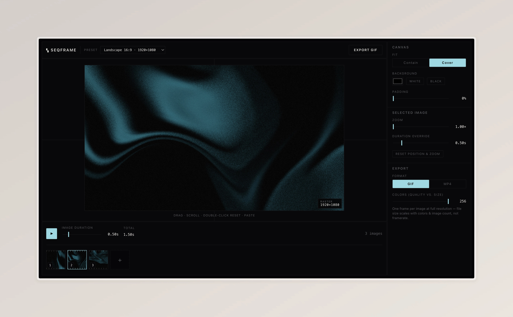

# seqframe

A minimal browser-based editor for turning image sequences into GIF or MP4 animations. Add images, arrange them on a timeline, crop and position each frame, export.

Essentially a more austere version of [sequence.video](https://sequence.video): no transitions and GIFs have only one frame per image to limit file size.



 

## Features

- **Image sequences** — Drop or pick multiple images, reorder them with drag-and-drop, and preview playback in the editor.
- **Aspect ratio presets** — Portrait 4:5, Vertical 9:16, Square 1:1, Landscape 16:9, and Story 9:16 (720p).
- **Per-frame editing** — Pan and zoom each image to crop it within the canvas. Double-click to reset position and zoom.
- **Canvas settings** — Choose contain or cover fit, background color, and padding around the content area.
- **Timing** — Set a global duration per image, or override duration on individual frames.
- **Export** — Download as GIF (adjustable palette size) or H.264 MP4 via WebCodecs (Chrome, Edge, Safari 16+).

The preview and export share the same rendering pipeline, so what you see in the editor is what gets exported.

## Getting started

```bash
npm install
npm run dev
```

Open the URL shown in the terminal (typically `http://localhost:5173`).

## Scripts

| Command         | Description              |
| --------------- | ------------------------ |
| `npm run dev`   | Start the dev server     |
| `npm run build` | Type-check and build     |
| `npm run preview` | Preview production build |
| `npm run lint`  | Run Oxlint               |

## Tech stack

- [React](https://react.dev/) + [TypeScript](https://www.typescriptlang.org/) + [Vite](https://vite.dev/)
- [@dnd-kit](https://dndkit.com/) for timeline reordering
- [gifenc](https://github.com/mattdesl/gifenc) for GIF encoding
- [mp4-muxer](https://github.com/Vanilagy/mp4-muxer) + WebCodecs for MP4 export
